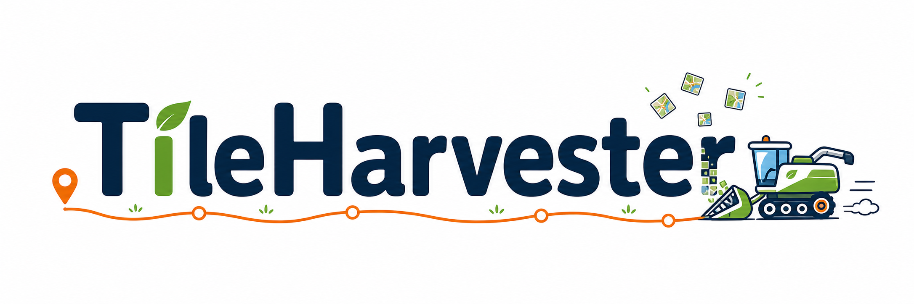
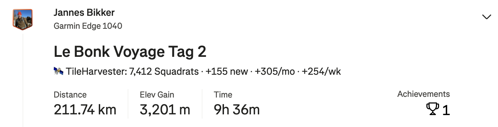

# TileHarvester 🗺️✨

Auto-drop [Squadrats](https://squadrats.com/rules) stats into your Strava descriptions. No scraping, no spam — just vibes.

## What it does

Every new activity gets a little line in the description:

```
🗺️ TileHarvester: 1,234 Squadrats · +13 new · +653/mo · +10/wk
```



Your friends will know you're grinding tiles 🚴‍♂️🏃‍♀️

## Quick start (UV)

```bash
# 1. grab it
git clone https://github.com/jb381/TileHarvester.git && \
    cd TileHarvester && \
    chmod u+x quick_start_uv.sh && \
    ./quick_start_uv.sh

```

Then either leave `uv run tileharvester sync` running, or use Docker/systemd for fire-and-forget.

## Docker (set it and forget it) 🐳

```bash
# 1. grab it
git clone https://github.com/jb381/TileHarvester.git && cd tileharvester

# 2. create your env
cp .env.example .env
# edit .env and add your Strava creds

# 3. build
docker compose build

# 4. one-time setup
docker compose run --rm tileharvester auth
docker compose run --rm tileharvester backfill

# 5. start background sync (checks every 5 minutes)
docker compose --profile cron up -d tileharvester-cron

# 6. watch the logs
docker compose --profile cron logs -f tileharvester-cron
```

Data survives in a Docker volume (`tileharvester-data`).

### Updating later

```bash
git pull
docker compose build
docker compose --profile cron up -d tileharvester-cron
```

## Common commands

| Command                     | What it does                             |
| --------------------------- | ---------------------------------------- |
| `tileharvester auth`        | Strava login 🔓                          |
| `tileharvester backfill`    | One-time history build 📚                |
| `tileharvester refine`      | Upgrade old data to full-GPS accuracy 🔬 |
| `tileharvester sync --once` | Single sync 🔄                           |
| `tileharvester sync`        | Keep watching 👀                         |
| `tileharvester status`      | What's up 📊                             |

Run `tileharvester --help` for the full menu.

## How data gets processed

TileHarvester has two ways to compute tiles from Strava activities:

| Method               | Accuracy               | Speed  | Used by          |
| -------------------- | ---------------------- | ------ | ---------------- |
| **Summary polyline** | Lower (corners cut)    | Fast   | `backfill`       |
| **Full GPS stream**  | Higher (actual points) | Slower | `sync`, `refine` |

### One-time setup flow

```
auth → backfill (fast, summaries) → refine (accurate, full streams)
```

1. **`auth`** — log in to Strava once
2. **`backfill`** — fetches your entire history quickly using summary polylines
3. **`refine`** — re-fetches full GPS streams for those historical activities to get accurate counts

### Ongoing flow

```
cron sync → automatically uses full GPS streams for every new activity
```

**New activities are always processed from full streams** — you get the best accuracy automatically going forward. Only historical data from `backfill` needs refinement.

Check your refinement status with `tileharvester status` — look for "Stream-refined" vs "Needs stream refinement".

### Rebuilding totals

If you change sport type filters or need to recalculate:

- **`recompute`** — rebuilds from stored data. Preserves refined activities, only recomputes summary ones.
- **`recompute-novelty`** — safe and fast. Rebuilds global totals from existing tiles without re-fetching anything.

### Manual offset

If counts still drift after refinement, you can nudge the lifetime total:

```bash
# Bump your lifetime Squadrat count by +5 on the next sync
uv run tileharvester sync --once --offset +5
```

For the cron job, set it in your `.env`:

```bash
TH_SQUADRAT_OFFSET=+5
```

That only adjusts the lifetime total shown in descriptions. Weekly and monthly counts are derived from your local DB and can't be tweaked individually.

## License 📄

MIT — use it, fork it, whatever.
