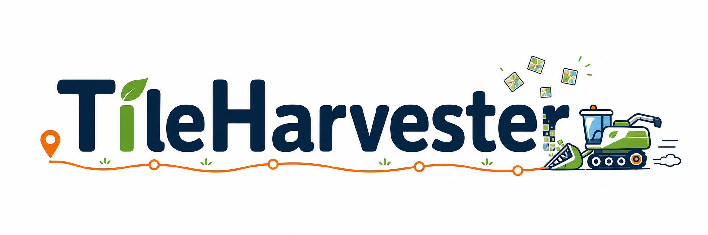
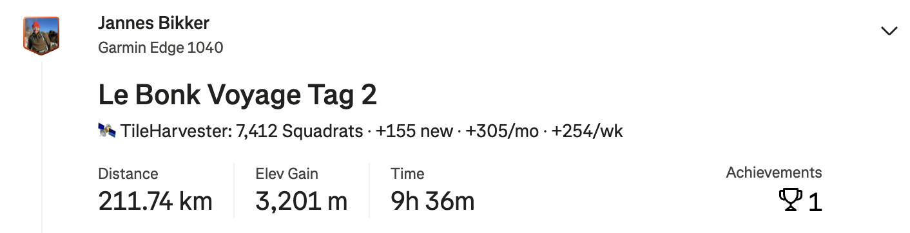

# TileHarvester 🗺️✨

Auto-drop [Squadrats](https://squadrats.com/rules) stats into your Strava descriptions. No scraping, no spam — just vibes.

## What it does

Every new activity gets a little line in the description:

```
🗺️ TileHarvester: 1,234 Squadrats · +13 new · +653/mo · +10/wk
```



Your friends will know you're grinding tiles 🚴‍♂️🏃‍♀️

## Quick start (UV)

```bash
# 1. grab it
git clone https://github.com/jb381/TileHarvester.git && cd TileHarvester
uv sync

# 2. grab Strava creds → https://www.strava.com/settings/api
export TH_STRAVA_CLIENT_ID="your-id"
export TH_STRAVA_CLIENT_SECRET="your-secret"

# 3. log in
uv run tileharvester auth

# 4. build your history
uv run tileharvester backfill

# 5. test it
uv run tileharvester sync --once
```

Then either leave `uv run tileharvester sync` running, or use Docker/systemd for fire-and-forget.

## Docker (set it and forget it) 🐳

```bash
# 1. grab it
git clone https://github.com/jb381/TileHarvester.git && cd TileHarvester

# 2. create your env
cp .env.example .env
# edit .env and add your Strava creds

# 3. build
docker compose build

# 4. one-time setup
docker compose run --rm tileharvester auth
docker compose run --rm tileharvester backfill

# 5. start background sync (checks every 5 minutes)
docker compose --profile cron up -d tileharvester-cron

# 6. watch the logs
docker compose --profile cron logs -f tileharvester-cron
```

Data survives in a Docker volume (`tileharvester-data`).

### Updating later

```bash
git pull
docker compose build
docker compose --profile cron up -d tileharvester-cron
```

## Common commands

| Command                     | What it does                             |
| --------------------------- | ---------------------------------------- |
| `tileharvester auth`        | Strava login 🔓                          |
| `tileharvester backfill`    | One-time history build 📚                |
| `tileharvester refine`      | Upgrade old data to full-GPS accuracy 🔬 |
| `tileharvester sync --once` | Single sync 🔄                           |
| `tileharvester sync`        | Keep watching 👀                         |
| `tileharvester status`      | What's up 📊                             |
| `tileharvester import-kml`  | Seed exact tiles from Squadrats 🧭       |
| `tileharvester compare-kml` | Audit local tiles against Squadrats 🔎   |

Run `tileharvester --help` for the full menu.

## How data gets processed

TileHarvester has two ways to compute tiles from Strava activities:

| Method               | Accuracy               | Speed  | Used by          |
| -------------------- | ---------------------- | ------ | ---------------- |
| **Summary polyline** | Lower (corners cut)    | Fast   | `backfill`       |
| **Full GPS stream**  | Higher (actual points) | Slower | `sync`, `refine` |

### One-time setup flow

```
auth → backfill (fast, summaries) → refine (accurate, full streams)
```

1. **`auth`** — log in to Strava once
2. **`backfill`** — fetches your entire history quickly using summary polylines
3. **`refine`** — re-fetches full GPS streams for those historical activities to get accurate counts

### Ongoing flow

```
cron sync → automatically uses full GPS streams for every new activity
```

**New activities are always processed from full streams** — you get the best accuracy automatically going forward. Only historical data from `backfill` needs refinement.

Successful syncs save a polling cursor. After downtime, TileHarvester resumes from
the last successful poll with the configured overlap window, so activities are not
silently missed. Existing installations without a cursor fall back to the newest
activity already stored locally.

Check your refinement status with `tileharvester status` — look for "Stream-refined" vs "Needs stream refinement".

### Optional exact Squadrats baseline

Squadrats can export your exact visited tiles as a KML file. TileHarvester can use one export
as an authoritative starting point, then track new tiles from Strava without relying on repeated
Squadrats downloads:

```bash
# Download the KML from the Squadrats desktop map after its activity sync is complete
uv run tileharvester import-kml ~/Downloads/squadrats-2026-08-01.kml

# Later exports are comparisons only; the original baseline stays immutable
uv run tileharvester compare-kml ~/Downloads/squadrats-latest.kml
```

The import reads the exact Squadrats and Squadratinhos layers, records the snapshot time and file
checksum, and rebuilds stored novelty without replacing existing processed history. For a known
export time, pass an explicit timestamp such as `--as-of 2026-08-01T18:43:00+02:00`; otherwise the
import time is used.

The KML is a cumulative snapshot and does not identify which historical activity first visited a
tile. On a fresh installation, lifetime totals are exact from the baseline and weekly, monthly, and
per-activity `new` counts accumulate from that point forward. `backfill` and `refine` remain available
when historical attribution matters. Without a KML baseline, TileHarvester behaves exactly as before.

### Rebuilding totals

If you change sport type filters or need to recalculate:

- **`recompute`** — rebuilds from stored data. Preserves refined activities, only recomputes summary ones.
- **`recompute-novelty`** — safe and fast. Rebuilds global totals from existing tiles without re-fetching anything.

### Manual offset

If counts still drift after refinement, you can nudge the lifetime total:

```bash
# Bump your lifetime Squadrat count by +5 on the next sync
uv run tileharvester sync --once --offset +5
```

For the cron job, set it in your `.env`:

```bash
TH_SQUADRAT_OFFSET=+5
```

That only adjusts the lifetime total shown in descriptions. Weekly and monthly counts are derived from your local DB and can't be tweaked individually.

## License 📄

MIT — use it, fork it, whatever.

## Recovery and validation

A failed processing attempt is retried by the next sync. Failed annotations are
retried while the activity is still inside the annotation window; use
`tileharvester retry` for older failures. `sync --once` exits nonzero if any
processing or annotation failed.

Refinement preserves existing tiles if Strava is unavailable or returns no usable
GPS data. Retry refinement after resolving the error. Routes over the configured
point limit fail explicitly rather than saving a truncated route; raise
`TH_STREAM_MAX_POINTS` (default 50,000) and retry if needed.

KML baselines require both Squadrats and Squadratinhos layers and the standard
z14/z17 zooms. Import and novelty rebuilding are atomic. Rasterization has limits
of 2,000,000 tiles per layer and 50,000,000 scan operations per ring; unusually large
or complex exports may be rejected without changing the database.

For development:

```bash
uv sync --frozen
uv run pytest --cov=tileharvester
uv run ruff check .
uv run ruff format --check .
uv run mypy tileharvester
```

See [the project review](docs/project-review.md) for findings, fixes, and test limits.
